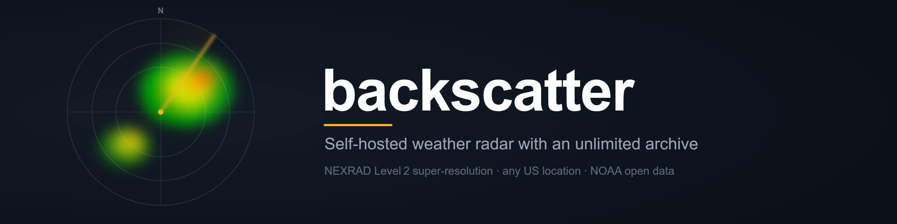
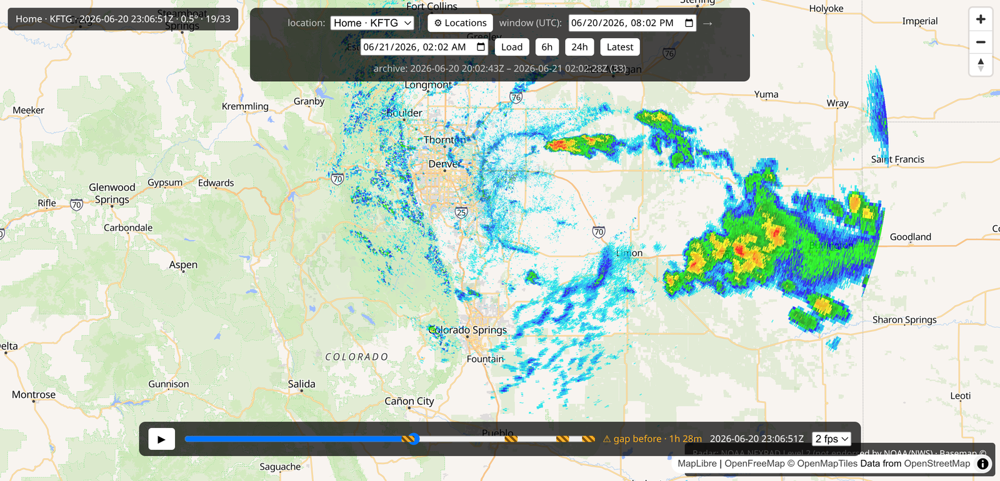

<p align="center">
  
</p>

<p align="center"><em>Self-hosted NEXRAD weather radar with an unlimited playback archive.</em></p>

<p align="center">
  <a href="LICENSE"></a>
  
  
  
</p>

backscatter pulls free NEXRAD Level 2 radar from NOAA's public archive, renders it on a
map in your browser, and — unlike subscription radar apps — **keeps every frame it
collects**, so you can scrub back across an entire storm or an entire season instead of
being capped to the most recent loop. It renders single-site **Level 2
super-resolution** (0.5° × 250 m — the highest resolution available for a point) and
works for **any location in the continental US**: point it at a lat/lon and it picks the
nearest covering radar automatically.

<p align="center">
  
</p>

**Quick links:** [Run with Docker](#run-with-docker-recommended-for-self-hosting) ·
[Roadmap](docs/ROADMAP.md) · [Contributing](CONTRIBUTING.md) ·
Docs site *(coming — see the [roadmap](docs/ROADMAP.md))*

> **Status:** early / work in progress. Built as a personal project.

## Why
Good radar apps are subscription-priced and cap how far back you can replay. The
underlying data is public and free. backscatter is a LAN-hosted alternative that
costs nothing to feed — no API keys, no paid data, no credit card — and builds a
long-running archive so playback isn't limited to recent data.

## Planned features
- Continuous collection of NEXRAD Level 2 volumes, automatic nearest-radar
  selection for any CONUS location
- Lowest-tilt reflectivity at native super-resolution, rendered on a MapLibre map
  (velocity / dual-pol products later)
- Unlimited timeline scrubbing / playback over the collected archive
- Failover to the next-nearest radar when the primary is offline
- Runs as a self-hosted service on a home server

## Data
Radar data comes from the NOAA Open Data Dissemination program's public S3 buckets
(NEXRAD Level 2), hosted by NSF Unidata. Access is anonymous and free.

This project uses unaltered NOAA NEXRAD data. NOAA makes the data openly
available; **this project is not endorsed by or affiliated with NOAA or the
National Weather Service.**

Nearest-radar selection uses a bundled static NEXRAD site table
([`src/backscatter/sites/nexrad_sites.csv`](src/backscatter/sites/nexrad_sites.csv)),
derived from the NOAA/NCEI HOMR station list (see that file's header for source URL
and retrieval date). It ships with the package and is never fetched at runtime.

## Not for life-safety
backscatter is an enthusiast tool. **Do not** use it for protection of life or
property. For warnings and official guidance, rely on the National Weather Service
and NOAA Weather Radio.

## Run with Docker (recommended for self-hosting)
One container runs both the server and the continuous collector; your whole archive
lives on the host so rebuilds never lose data.

```
cp .env.example .env          # edit locations / retention / port
docker compose up -d --build  # build the image and start both processes
docker compose logs -f        # watch collect cycles
```

Open the map at `http://<host-ip>:8000` from any device on your LAN (set `PORT` in
`.env` to change the published port; the container always serves on 8000 internally).

- **Where data lives:** everything — raw volumes, rendered PNGs, and the SQLite DB —
  is written to **`./data`** in this directory (bind-mounted to `/data` in the
  container). Back it up by copying that folder; `docker compose down && up` keeps it.
- **Configuration** is via `.env` (maps to the same env the app reads — no
  Docker-specific config). On the **first** run with an empty `./data`,
  `BACKSCATTER_LOCATIONS` seeds the location store; after that the DB is the source of
  truth (manage locations in the UI), and the env seed is ignored. Retention
  (`BACKSCATTER_RETENTION_DAYS`, `…_MAX_GB`) and poll interval pass through the same way.
- **Permissions:** the container runs as your host user (`PUID`/`PGID`, default
  `1000:1000`) so the `./data` bind mount is writable without root. If `id -u` / `id -g`
  differ on your host, set `PUID`/`PGID` in `.env`. (This is for standard rootful
  Docker. On **rootless** Docker, container-root already maps to your host user — there,
  comment out the `user:` line in `docker-compose.yml` so it runs as container-root.)
- **Lifecycle:** if either process dies the container exits and `restart: unless-stopped`
  brings the whole thing back (it never runs half-up); a healthcheck pings the API. Stop
  with `docker compose down` (the archive in `./data` persists).

The image is glibc-based (Debian slim) because Py-ART's scientific stack ships only
manylinux wheels; it's a chunky image (~the scientific stack) but builds with no system
build tools.

## Quickstart (without Docker)
Early build — a few commands work end to end:

```
uv run backscatter pull              # fetch the latest volume for the configured site
uv run backscatter render <volume>   # render one georeferenced frame (PNG + bounds)
uv run backscatter serve             # serve the map UI at http://<host>:8000
uv run backscatter prune --dry-run   # preview what retention would delete (no deletes)
uv run backscatter backfill KFTG --start 2026-06-01T00:00:00Z --end 2026-06-02T00:00:00Z --dry-run
```

`serve` opens a MapLibre map (keyless OpenFreeMap basemap) centered on your
configured location, with a **timeline scrubber + play/pause** over every frame
`collect` has accumulated — scrub or loop across the whole archive. **Missing-data
spans** (where collection was down and backfill hasn't filled in) are marked with an
amber hatch on the scrubber track, and a "⚠ gap before" indicator shows when the
current frame sits just after one — so playback never silently implies continuity
across a hole. Playback still runs straight across gaps; the marker is the cue. With multiple
configured locations, a **location selector** switches the active one (re-centering
the map and re-pointing the timeline at that location's radar). Locations are
**managed in the UI** (add / edit / delete / set-default) and persisted in the
SQLite store; `BACKSCATTER_LOCATIONS` only *seeds* an empty store (see ADR-0008). A
running `collect` picks up location changes within a cycle — no restart. Run
`backscatter collect` for a while first to build up frames (one every ~5 min).
See [`docs/ROADMAP.md`](docs/ROADMAP.md) for build status.

### Retention
The archive is bounded by a configurable retention policy (see ADR-0009) so it
doesn't grow without limit. Two independent limits, both managed via env:
- **Age limit** — delete frames older than N days. **Default 30 days, ON.** Set
  `BACKSCATTER_RETENTION_DAYS=0` to disable.
- **Size cap** — delete oldest-first once the archive exceeds N GB. **Default
  off/unlimited** (opt-in, no surprise deletion); set `BACKSCATTER_RETENTION_MAX_GB`.

Both can be active at once — a frame is pruned if it violates *either*. A running
`backscatter collect` prunes automatically (throttled to once per
`BACKSCATTER_PRUNE_INTERVAL`, default 1h). `backscatter prune` runs it on demand;
**`backscatter prune --dry-run` previews exactly what would be deleted without
touching anything** — run that first. The live command prompts for confirmation
unless you pass `--yes`. Pruning removes the raw volume, its rendered frame, and the
index row together, so a pruned frame leaves the timeline cleanly.

### Backfill
`collect` only ever fetches the *latest* volume. To fill the archive with **historical**
data — a past storm, a gap while the collector was down — use `backfill`:

```
backscatter backfill [target] --start <UTC> --end <UTC> [--dry-run] [--yes]
```

`target` is a location name or a site code (defaults to the configured site). It lists
the assembled Level 2 volumes for that site across the range and runs the same
pipeline as collection per volume — download, render, index — deduped on
`(site, scan_time)`, so it fills holes and **re-running a range is idempotent** (adds
nothing). **`--dry-run` first**: it reports the volume count, span, and approximate
download size without fetching (a year is thousands of pulls — see the scale before
committing). The live run prompts for confirmation unless `--yes`.

Note the retention interaction (see ADR-0009): the age limit prunes by `scan_time`, so
if your range is older than `BACKSCATTER_RETENTION_DAYS`, backfilled frames will be
pruned on the next prune pass. Backfill **warns** when that's the case — raise or
disable retention (`BACKSCATTER_RETENTION_DAYS=0`) to keep them.

The timeline is driven by `GET /api/frames?site=&start=&end=&cursor=&limit=` —
rendered frames from the index, oldest-first, capped per request (default 500, max
2000). With no `start`/`cursor` it returns the most recent window; pass `start`/`end`
to load a historical window and follow `next_cursor` (an exclusive `scan_time`
cursor) to page forward through spans larger than one request — the UI does this
transparently while playing. `GET /api/frames/range?site=` reports the archive's
min/max scan time and count so the picker can bound itself to what exists.
(URL-encode timestamp params — `scan_time` contains `+`.)

## License
[MIT](LICENSE) © 2026 Kris Bennett.

Radar data is NOAA NEXRAD Level 2, used unaltered from NOAA's free public archive;
this project is not endorsed by or affiliated with NOAA or the National Weather Service.
