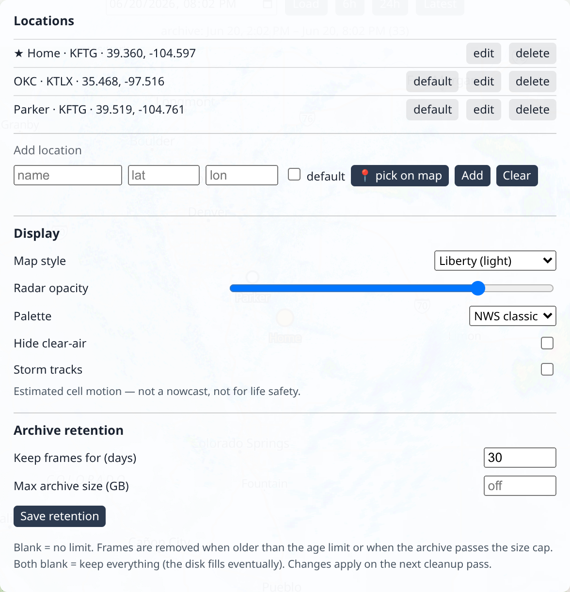

# Configure it

Once backscatter is running, here's how to make it yours: set your location, add more
places, and decide how much history to keep. **No technical knowledge needed.**

There are two ways to configure things, and you can mix them:

- **In the app** — point and click, right in your browser. Easiest for locations.
- **In the `.env` file** — the text file you edited during setup. Best for the "keep how
  long" setting.

## Your location

A **location** is just a place you want radar for — your town, say. backscatter takes the
latitude and longitude you give it and automatically picks the **nearest weather-radar
station** (there are 150-plus across the U.S.). You never have to know which station;
it just works.

You already set one location during setup. To change it, edit the `BACKSCATTER_LOCATIONS`
line in your `.env` file (see your platform's
[Get started](get-started/index.md) guide), or add/edit locations right in the app —
which is usually easier:

## Adding and managing locations (in the app)

Click the **⚙ Locations** button at the top of the page. A panel opens where you can add,
edit, rename, delete, and choose your default location:



To **add a place**:

1. Click **⚙ Locations**.
2. Type a **name** (anything you like — "Home", "Lake house", "Mom's").
3. Enter its **latitude** and **longitude** — or click **📍 pick on map** and then click
   the spot on the map.
4. Click **Add**. Done — it appears in the list and in the location switcher.

The **default** location (marked with a ★) is the one shown when you first open the page.
Use **set default** on any location to change it.

!!! info "Your locations are remembered"
    Once you've added locations in the app, backscatter saves them. They stick around
    when you stop and restart it — you don't have to set them up again. (The
    `BACKSCATTER_LOCATIONS` line in `.env` is only used the very first time, to give you a
    starting point.)

!!! tip "Two towns near the same radar?"
    That's fine — backscatter is smart about it. If two of your places are covered by the
    same radar station, it only fetches that radar once and shares it. No wasted effort.

## How much history to keep (retention)

backscatter saves **every** radar picture it collects, forever — unless you tell it not
to. That's wonderful for replaying storms, but radar adds up, so backscatter can tidy up
after itself automatically. This is called **retention**.

There are two simple dials. The easiest way to set them is **in the app**: open the ⚙
**Locations** panel and find **Archive retention** — enter a number of days and/or a size
in GB (leave a box blank to turn that limit off), then **Save**. Changes apply on the next
cleanup pass, no restart needed.

| Dial | What it does | Default |
| --- | --- | --- |
| Keep frames for (days) | Delete radar older than this many days. | **30 days** |
| Max archive size (GB) | Also delete the oldest radar once your archive passes this size. | **Off** (no size limit) |

So out of the box, backscatter keeps the **last 30 days** and quietly removes anything
older. Set a box to blank (or `0` days) to turn that limit off; leave **both** blank to
keep **everything forever** (your disk will fill eventually).

!!! note "The `.env` values just seed the first run"
    `BACKSCATTER_RETENTION_DAYS` and `BACKSCATTER_RETENTION_MAX_GB` in `.env` set the
    **starting** policy on a brand-new archive. After that the app's setting is the source
    of truth — edit it under **Archive retention**, not `.env` (just like locations). This
    is [ADR-0013](dev/decisions.md).

!!! warning "Deleting is permanent"
    When retention removes old radar, it's gone for good (you could always re-download it
    later with a backfill, but it's not in a recycle bin). The 30-day default is a safe,
    sensible starting point — raise it whenever you like.

## Changing the port

backscatter opens at **`http://localhost:8085`** by default. If `8085` is already used by
something else on your computer — or you just prefer a different number — change one line
in your `.env` file:

```
BACKSCATTER_PORT=8085
```

Set it to, say, `9000`, save, and run `docker compose up -d` in the project folder to
apply it. Then open **`http://localhost:9000`** instead. That single value is used both
inside the app and for the address you open — there's nothing else to change.

## What else is in `.env`?

A few more optional dials, all explained with comments inside the file:

- `BACKSCATTER_PORT` — the web address port (default `8085`; see above).
- `BACKSCATTER_POLL_INTERVAL` — how often it checks for new radar (default 60 seconds;
  you rarely need to change this).
- `PUID` / `PGID` — Linux file-ownership (see the [Linux guide](get-started/linux.md)).

Ready to actually *use* it? Head to the **[tour](using.md)**.
