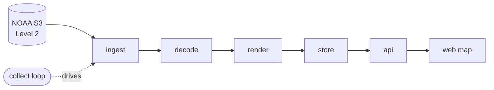

# How it fits together

backscatter is a straight pipeline: pull a radar volume, decode it, draw it, save it,
serve it. A background loop runs the pipeline on an interval; the API hands the saved
frames to the browser.

Each stage is its own package under
[`src/backscatter/`](https://github.com/kbennett2000/backscatter/tree/main/src/backscatter):

| Stage | Package | What it does |
| --- | --- | --- |
| **ingest** | `ingest/` | Lists and downloads assembled Level 2 volumes from NOAA's public S3 bucket (anonymous, no credentials). Dedupes on `(site, scan_time)`. |
| **sites** | `sites/` | Bundled NEXRAD site table; resolves the nearest covering radar for a lat/lon. |
| **decode** | `decode/` | Reads a volume with **Py-ART** and extracts the lowest-tilt reflectivity sweep. |
| **render** | `render/` | Reprojects gate geometry to Web Mercator and applies the NWS dBZ color table → a georeferenced PNG + a small bounds sidecar. |
| **store** | `store/` | SQLite index of every frame (+ the mutable locations table); raw volumes and PNGs on disk are the source of truth. |
| **collect** | `collect/` | The long-running loop that walks ingest→render→index for each location, with failover and a throttled retention prune. |
| **api** | `api/` | FastAPI app: serves rendered tiles + a small JSON timeline API. |
| **web** | `web/` | A deliberately light MapLibre frontend (vanilla JS) — the map, timeline, and controls. |

## A few load-bearing ideas

- **The raw volumes on disk are the source of truth** (the SQLite index just records
  what exists); pruning a frame deletes the volume, its render, and the row together.
- **Locations are mutable, persisted state.** They live in SQLite, not code. The
  `BACKSCATTER_LOCATIONS` env var only *seeds* an empty store on first run — after that
  the database wins, and you manage locations in the UI.
- **Rendering correctness is the thing that will bite you.** A wrong projection, flipped
  axis, or bad color mapping produces an image that looks plausible but is wrong — so
  anything touching geometry or color gets value-based tests **and** a visual check
  against a reference. See [Contributing](contributing.md).
- **Everything configurable is read in one place** (`config.py`). No module reads the
  environment directly.

## Want the "why"?

The [Design decisions](decisions.md) (ADRs) record the real architectural choices —
ingestion strategy, storage model, site selection, rendering geometry, retention, and
more — with the alternatives that were weighed. The [Roadmap](../ROADMAP.md) shows how
the app was built up one reviewable slice at a time.
