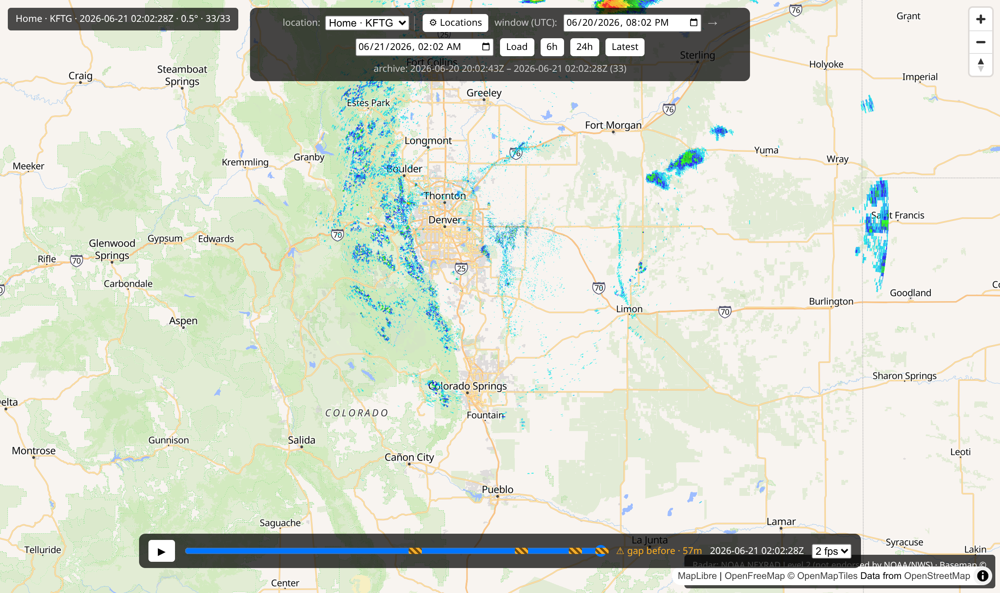

# Set up on macOS

This is the full, click-by-click guide for **macOS** (any modern Mac). Nothing is
assumed — follow along top to bottom.

!!! tip "What we're about to do"
    Install Docker → download backscatter → tell it where you live → start it → open it
    in your browser. About 15–20 minutes, mostly waiting.

## Step 1 — Install Docker Desktop

Docker is a free program that runs backscatter for you. On a Mac it's called **Docker
Desktop**.

1. Go to the official download page: **<https://www.docker.com/products/docker-desktop/>**
2. Click **Download for Mac**. If it offers a choice, pick:
    - **Apple Silicon** — for M1, M2, M3 (and newer) Macs. *(Most Macs from 2020 on.)*
    - **Intel chip** — for older Intel-based Macs.
3. Open the downloaded **`Docker.dmg`**, then drag the **Docker** whale icon into your
   **Applications** folder.
4. Open **Docker** from Applications (you may need to right-click → **Open** the first
   time, and confirm). Accept the terms when asked.
5. You can **skip** the sign-in/account step — you don't need an account.

??? question "Which chip does my Mac have?"
    Click the **Apple menu** () in the top-left → **About This Mac**. If it mentions
    "Apple M1/M2/M3…" choose **Apple Silicon**; if it says "Intel", choose **Intel chip**.

You'll know Docker is ready when the **whale icon** appears in your menu bar (top-right)
and stops animating.

!!! info "Why these steps don't have screenshots"
    Docker Desktop's installer is made by Docker and its look changes over time. Rather
    than show screenshots that might not match, we link to Docker's own page, which always
    has current pictures. The backscatter steps below **do** have screenshots — those are
    ours and they don't change.

!!! warning "Keep Docker Desktop running"
    backscatter runs *inside* Docker, so Docker Desktop needs to be open (the whale in
    your menu bar) whenever you want to use it.

## Step 2 — Download backscatter

1. Open this page: **<https://github.com/kbennett2000/backscatter>**
2. Click the green **`< > Code`** button, then **Download ZIP**.
3. Find `backscatter-main.zip` in your **Downloads** folder and double-click it to
   unzip. You'll get a folder called **`backscatter-main`**.
4. Move that folder somewhere easy to find, like your **Documents** folder.

!!! note "Prefer the command line? (optional)"
    If you already use `git`, you can instead run
    `git clone https://github.com/kbennett2000/backscatter.git`. If that means nothing to
    you, ignore it — the ZIP download is all you need.

## Step 3 — Tell it where you live

backscatter needs your location so it can show *your* nearest radar.

1. Open the `backscatter-main` folder in **Finder**.
2. Find the file named **`.env.example`**, copy it (⌘C then ⌘V), and rename the copy to
   exactly **`.env`**.

    !!! tip "Can't see `.env` / files starting with a dot?"
        Finder hides files that start with a dot. In the `backscatter-main` folder,
        press **⌘ + Shift + . (period)** to show them; press it again to re-hide.

3. Open `.env` with **TextEdit** (right-click → **Open With** → **TextEdit**).
4. Find the line starting with `BACKSCATTER_LOCATIONS=` and change the numbers to your
   own latitude and longitude:

    ```
    BACKSCATTER_LOCATIONS=[{"name":"Home","lat":39.3603,"lon":-104.5969,"default":true}]
    ```

    Replace `39.3603` with your latitude and `-104.5969` with your longitude. Keep the
    quotes and brackets exactly as they are.
5. Save (⌘S) and close TextEdit.

??? question "How do I find my latitude and longitude?"
    Open [Google Maps](https://www.google.com/maps), right-click your town, and click the
    numbers at the top of the little menu — that copies them. First number is latitude,
    second is longitude.

More options (keeping radar longer, adding towns) are on the
**[Configure it](../configure.md)** page — but the one line above is all you need to
start.

## Step 4 — Start it

1. Open the **Terminal** app (press **⌘ + Space**, type *Terminal*, press **Enter**).
2. Type `cd ` (the letters c, d, then a space — don't press Enter yet), then **drag the
   `backscatter-main` folder from Finder into the Terminal window** and press **Enter**.
   This points Terminal at the folder.
3. Type this and press **Enter**:

    ```bash
    docker compose up -d --build
    ```

4. The **first** time, this downloads and builds everything — several minutes, lots of
   text. Normal. It's done when you get your prompt back and see lines ending in
   `Started`.

!!! success "That's the hard part over"
    From now on, starting backscatter is just `docker compose up -d` (no `--build`).

## Step 5 — Open it

Open your web browser and go to:

**<http://localhost:8085>**

!!! tip "Want a different port?"
    `8085` is the default. If it's already taken — or you just prefer another number —
    change `BACKSCATTER_PORT` in your `.env` file, run `docker compose up -d` again, and
    use that number here instead.

You should see a map centered on your location, like this:



🎉 **You did it!**

## What now?

- It starts **empty** and fills in over time — a new radar picture every few minutes
  while it runs. Leave it going and check back.
- Want a past storm *now*? You can **backfill** older radar — see
  **[Help & FAQ](../help.md#i-dont-want-to-wait-can-i-load-past-radar)**.
- Learn the map, timeline, and playback on the **[Using backscatter](../using.md)** tour.
- To stop it: in the same Terminal folder, run `docker compose down`. Your saved radar
  stays put.

Hit a snag? The **[Help & FAQ](../help.md)** covers the common ones in plain language.
