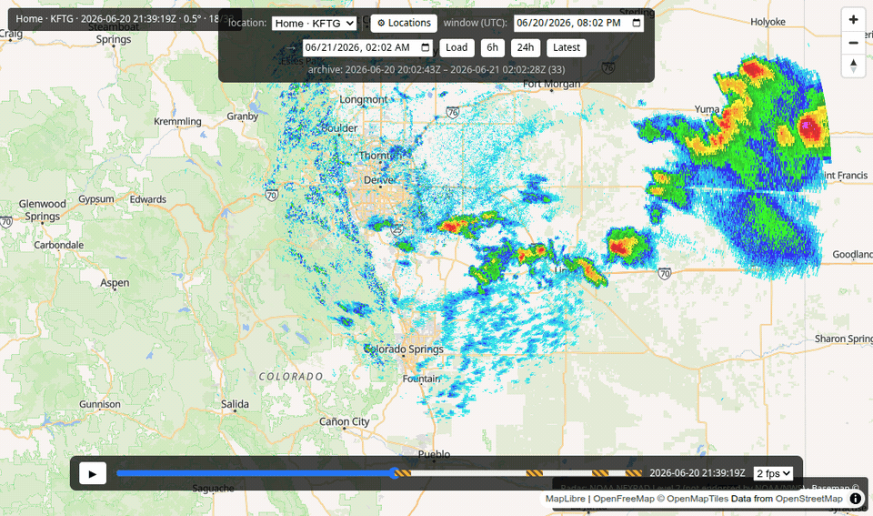

---
hide:
  - toc
---

# Welcome 👋

**backscatter is a free weather-radar app that you run on your own computer.**

You know those weather-radar maps on the news — the green, yellow, and red blobs that
show where rain and storms are? backscatter puts one of those on *your* screen, centered
on *your* town, using the same official data the professionals use. And it's completely
free.

Here's the part that makes it special: most radar apps only let you rewind a little
while. backscatter quietly saves **every** picture it collects, so you can rewind and
replay an **entire storm** — or look back across a whole season — like a DVR for the sky.

You don't need to be technical to use it. If you can install an app and copy a couple of
lines, you can run backscatter. These pages walk you through every step with pictures.

## Get started — pick your computer

-   :fontawesome-brands-windows: __Windows__

    ---

    Windows 10 or 11. Click-by-click, nothing assumed.

    [:octicons-arrow-right-24: Set it up on Windows](get-started/windows.md)

-   :fontawesome-brands-apple: __macOS__

    ---

    Any modern Mac (Apple Silicon or Intel).

    [:octicons-arrow-right-24: Set it up on macOS](get-started/macos.md)

-   :fontawesome-brands-linux: __Linux__

    ---

    Ubuntu and other common distributions.

    [:octicons-arrow-right-24: Set it up on Linux](get-started/linux.md)

## What you get

- :material-radar: **Live radar for your location.** Point it at your town and it
  automatically picks the nearest weather-radar station.
- :material-history: **An unlimited rewind.** Scrub back through every frame it has
  saved and replay storms start to finish.
- :material-map-marker-multiple: **As many places as you like.** Watch home, the cabin,
  and grandma's town — switch between them with one click.
- :material-lock-open: **Free and yours.** No accounts, no subscriptions, no fees. The
  data comes straight from the U.S. government's free public weather service, and
  everything runs on your own machine.

!!! note "A friendly heads-up"
    backscatter is a fun hobby tool, **not** an official warning system. For real
    weather warnings and safety decisions, always rely on the National Weather Service
    and your local officials. Think of backscatter as your personal radar replay — not a
    substitute for the pros.

## New here? Start at the top

1. **[Get it running](get-started/index.md)** — pick your computer and follow along.
2. **[Set your location](configure.md)** — tell it where you live (and add more places).
3. **[Take the tour](using.md)** — learn the map, the timeline, and playback.
4. Stuck? **[Help & FAQ](help.md)** has the common hiccups in plain language.

*Curious how it works under the hood, or want to tinker? There's a whole
[For developers](dev/index.md) section.*
