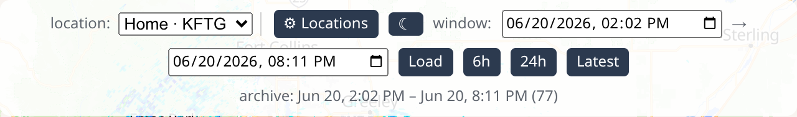
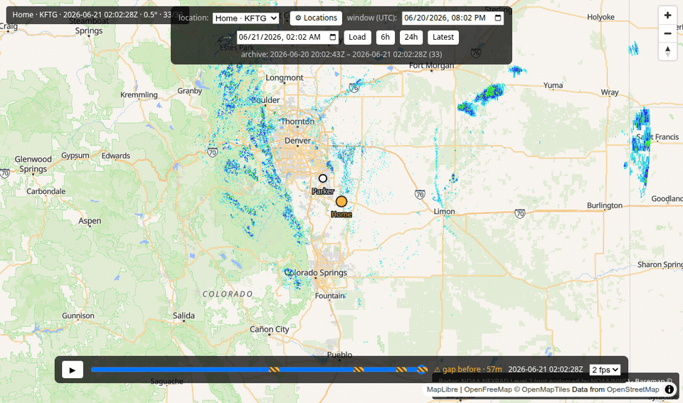
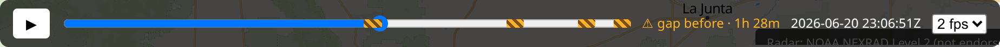

# Using backscatter

A friendly tour of what you're looking at and how to drive it. Here's the whole thing at
a glance:

## The map and the radar colors

The map works like any other — **drag** to move around, **scroll** (or pinch) to zoom in
and out.

The colorful blobs are the radar. The colors show how heavy the rain or storm is, from
light to intense:

- **Light blue / blue** — very light rain or drizzle.
- **Green** — steady rain.
- **Yellow / orange** — heavy rain, maybe a thunderstorm.
- **Red / magenta** — very intense: downpours, hail, strong storms.

Empty map means clear skies there — nothing to show.

!!! info "Where the radar comes from"
    Each picture is real data from the nearest official U.S. weather-radar station,
    showing the lowest, most detailed sweep. backscatter doesn't alter it — same source
    the professionals use.

## The readout (top-left)

The little panel in the top-left tells you exactly what you're looking at:

It shows your **location**, the **radar station** serving it, the **date and time** of
the picture on screen, the radar tilt angle, and which frame you're on (e.g. `30/33`).

## The timeline — play and rewind (the fun part)

Along the bottom is the **timeline**. This is what makes backscatter special: it's a DVR
for the sky.

- Press **▶** to **play** — the radar animates forward so you can watch a storm move.
- Drag the slider to **scrub** to any moment — jump straight to last night's storm.
- The **fps** menu changes the playback speed.

Press play and watch it go:

Or grab the slider and sweep through history yourself:

## Looking further back (the history bar)

The bar at the top lets you jump to any stretch of saved radar:

- The **6h** and **24h** buttons jump to the last 6 or 24 hours.
- Set a **start** and **end** date/time and click **Load** to pull up a specific window —
  great for "show me Tuesday's storm."
- **Latest** snaps back to the most recent radar.

How far back you can go depends on how long backscatter has been collecting (and your
[retention setting](configure.md#how-much-history-to-keep-retention)).

## Switching between your locations

If you've added more than one place, a **location** dropdown appears at the top. Pick a
different one and the map flies there and shows that town's radar:

## Gap markers — "no data here"

backscatter only has radar for the times it was actually running. If it was switched off
for a while, there's a **gap** — and it tells you, honestly, instead of pretending the
storm jumped.

Gaps show up as **amber striped patches** on the timeline, and when you land just after
one, a small **"⚠ gap before"** note appears with how long the gap was:

So if you ever see the radar "jump," the markers tell you whether that's a real fast-
moving storm or just a stretch where nothing was collected. (Want to fill a gap? You can
[backfill](help.md#i-dont-want-to-wait-can-i-load-past-radar) it.)

---

That's the whole app! Anything not behaving? The **[Help & FAQ](help.md)** is next.
